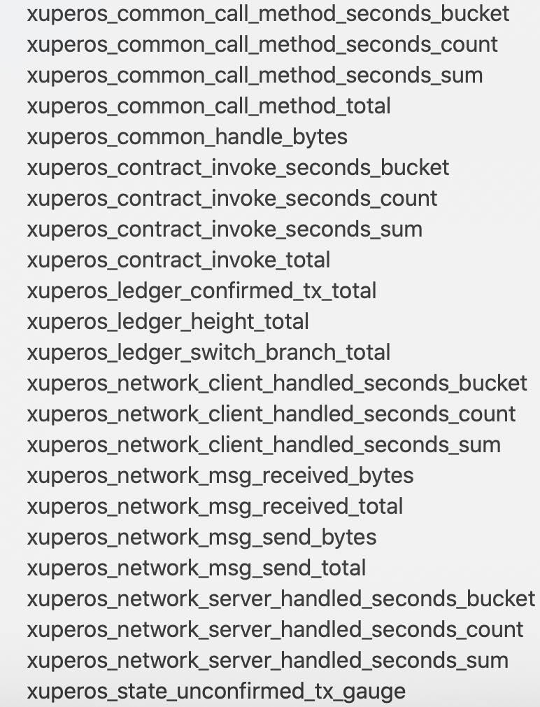
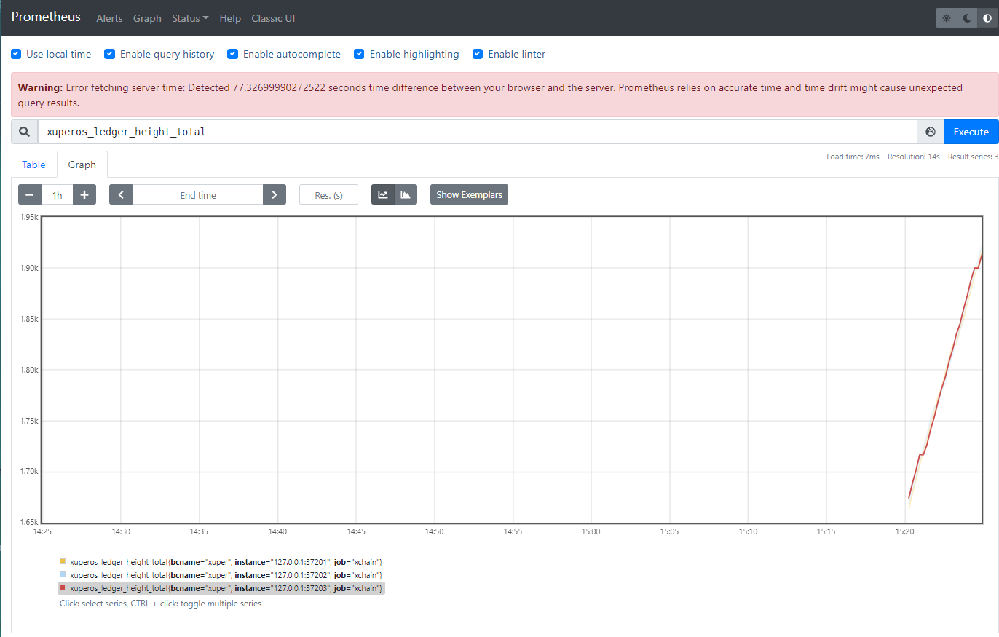
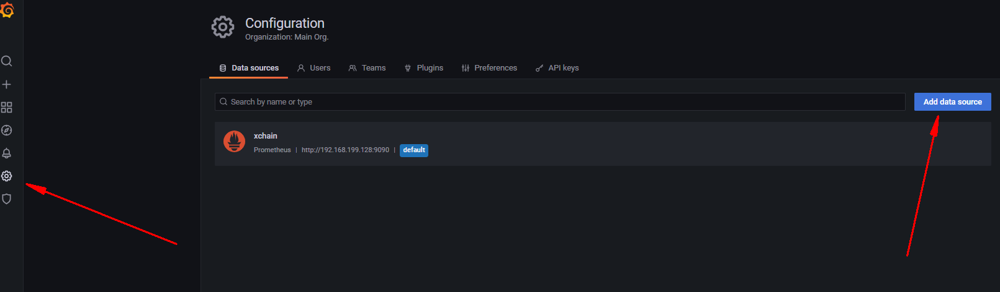
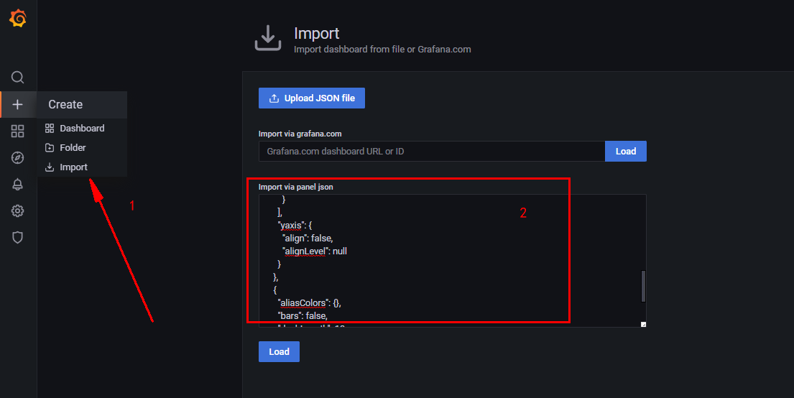
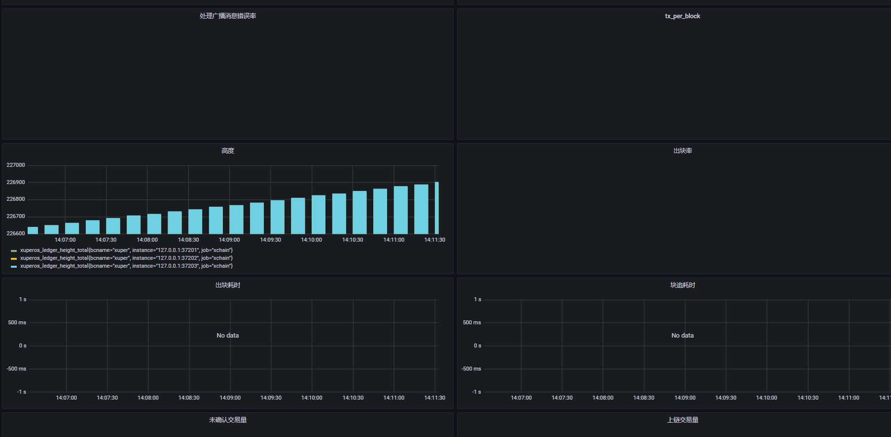

### 监控搭建

搭建监控说明文档，本文结合promethues和grafana工具搭建一套xchain的监控体系。

### 1 监控项说明

目前支持的监控项如下图：



每个大项说明如下：

- xuperos_common_call_method_seconds：调用方法监控，可以查看到每个函数的数据；
- xuperos_contract_invoke：合约调用相关监控项；
- xuperos_ledger：账本相关数据监控项；
- xuperos_network：网络相关监控项。

### 2 监控系统搭建

#### 2.1 搭建网络

以三节点部署为例子搭建网络，各个节点 env.yaml 配置中打开 metricSwitch ，如下所示：

```
# Metric switch
metricSwitch: true
```

同时在 server.yaml 中可以设置端口，如果是多个节点，每个节点都需要设置：

​	node1

```
metricPort: 37201
```
​	node2

```
metricPort: 37202
```

​	node3

```
metricPort: 37203
```
各个节点配置完成后启动节点。
#### 2.2 使用prometheus查看监控

1. prometheus 下载安装教程

   https://prometheus.io/download/  

   https://prometheus.io/docs/introduction/first_steps/

2. 进入prometheus目录，配置promethues设置endpoint服务：

   修改prometheus.yaml文件，添加如下配置配置文件

```
scrape_configs:
- job_name: 'xchain'
  scrape_interval: 3s
  static_configs:
    - targets:
       - '127.0.0.1:37201'
       - '127.0.0.1:37202'
       - '127.0.0.1:37203'
```

3. 启动prometheus，建议使用root启动。
```
sudo nohup ./prometheus --config.file=prometheus.yml &
```

4. 查看对应监控

​     a. http://localhost:9090/graph

​     b.xuperos_ledger_height_total



####  2.3 结合prometheus使用Grafana查看监控

1. 下载grafana

   https://grafana.com/grafana/download?pg=get&plcmt=selfmanaged-box1-cta1 

2. 启动，建议使用root。

```
nohup ./bin/grafana-server &
```

3. 登录修改admin密码

   访问http://localhost:3000，第一次访问需要使用账号登录。默认用户admin,密码：admin。

4. 导入数据源，在 grafana 页面导入数据源并选择 Prometheus。



5. 导入 grafana 模板,然后导入 xbench 下的 [模板](https://github.com/xuperchain/xbench/blob/master/conf/metric/grafana-xchain.json)

   

6. 导入成功之后可以看到如下

   

