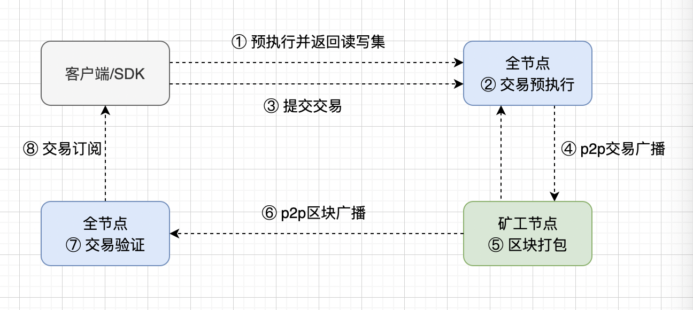
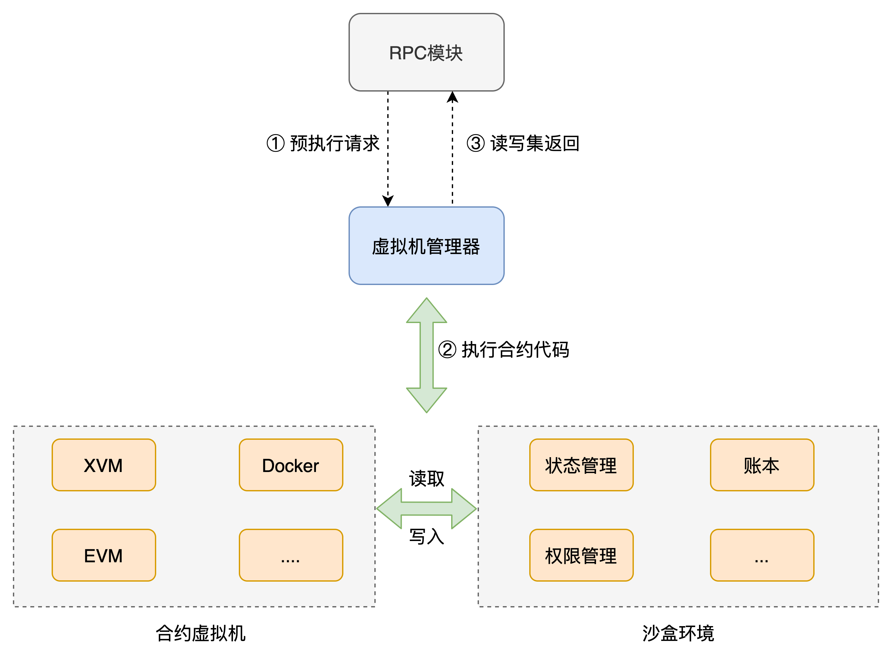
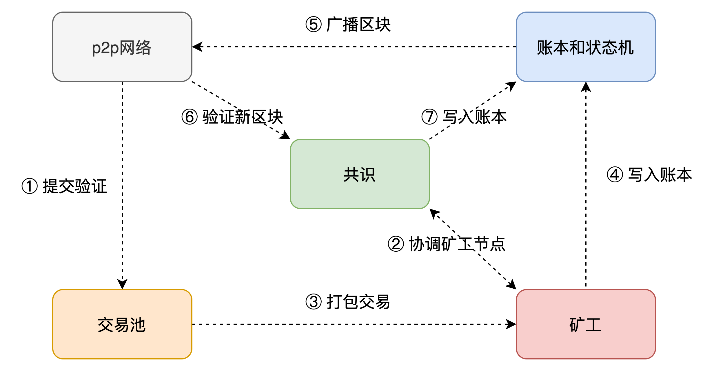

###  1.1 交易上链流程

图中的每个图块是一个 matrixchain节点。流程如下：

1. 用户使用 matrixchain客户端或者 SDK 把合约的执行参数包装到一个预执行请求，接着发送到一个 matrixchain的全节点。
2. 全节点收到请求之后进行合约预执行，如果执行成功则返回执行后的读写集给客户端。
3. 客户端拿到读写集之后，在本地组装交易，同时用本地私钥进行交易签名，完成之后把完整的交易发送到区块链网络中。
4. 任意节点收到来自客户端的提交交易请求后通过p2p网络把交易广播给整个网络，从而让矿工能发现新的交易。
5. 矿工在收到来自p2p的交易后，通过打包区块把交易组装到一个新的区块里面，同时加上自己的签名。
6. 矿工打包区块完毕之后，把新的区块通过p2p网络广播给其他节点。
7. 其他节点在接收到矿工的新区块之后，进行区块的合法性验证，比如签名、共识、交易等验证，验证都通过后就计入到本地账本。
8. 客户端通过订阅的方式了解到自己的交易被打包到新的区块，这个时候即可认为交易已经上链。

###  1.2 预执行流程

matrixchain采用的是合约预执行模型，交易在正式提交之前通过合约预执行获取读写集，即上链的交易包含了合约的执行结果，下图展示了预执行在一个节点内部的过程。

其中每个图块是一个抽象功能模块，流程如下：

1. 虚拟机管理器模块在收到来自RPC模块的预执行请求后，根据请求参数选取合适的合约虚拟机，同时构造好执行合约所需要的沙盒环境。
2. 接着找到合约代码，将其运行于合约虚拟机里面，在这个过程中，合约虚拟机会不停地跟沙盒环境进行交互，进行资源的读取和写入操作。期间如果合约因为执行超资源或者异常，合约执行过程直接终止，期间产生的读写操作因为作用与沙盒之上，并不会对真实的存储产生影响，从而保证了合约执行的原子性和隔离性。
3. 合约执行完毕之后，沙盒里面记录了合约执行过程中产生的读写集，之后把读写集返回给客户端，即完成了预执行过程。

### 1.3 区块打包流程

 一个区块链交易只有通过矿工打包进区块才能上链，下图分别从矿工节点以及从节点视角看待一个区块是如何产生的，以及如何被确认的。

其中每个图块是一个抽象功能模块，流程如下：

1. 来自p2p网络的交易首先会进行交易合法性验证，包括签名，双花，读写集等验证，如果都通过通过之后就进入到交易池里面。
2. 在共识模块的协调下，选出这一轮的矿工。
3. 矿工从交易池里面选取一批交易进行打包，打包完毕之后使用私钥加上自己的签名。
4. 矿工在生成新区块之后首先会写入到自己的账本，同时更新状态机以反映最新的区块变化。
5. 矿工更新完本地账本之后，接着通过p2p网络进行新区块的广播，其他节点通过p2p网络接收到来自矿工的新区块。
6. 从节点在收到一个新的区块之后，会对区块以及区块里面的交易进行验证，对区块的验证会借助共识模块进行矿工的合法性验证，对交易的验证跟预执行过程一样，通过传入相同的输入给合约虚拟机，看能不能得到相同的输出，如果匹配则认为通过了交易验证。
7. 一切验证通过之后就把新区块持久化到本地账本，至此完成了区块的打包到广播到其他网络节点的全过程