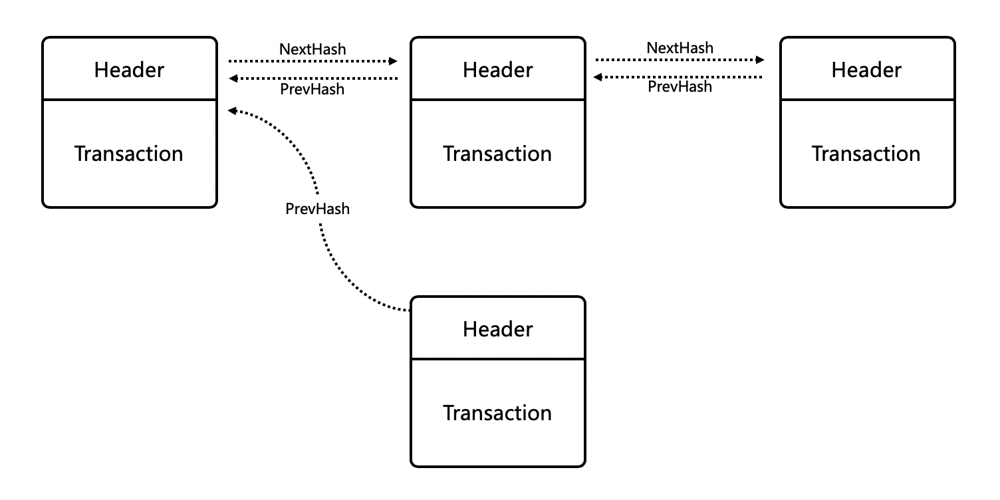
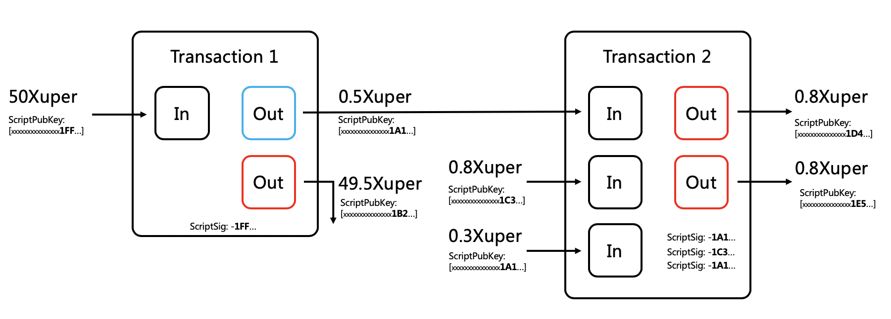
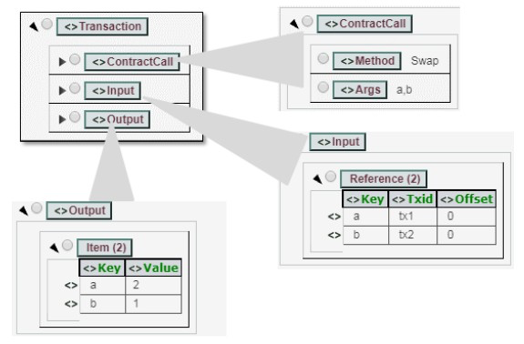
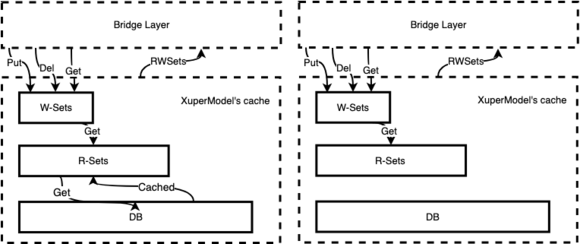

###  5.1 核心数据结构

涉及到账本的核心数据结构包括：区块、交易、UTXO、读写集。

####  5.1.1 区块

- 背景：所谓区块链，简单来说就是不同的区块以DAG方式链接起来形成的链。因此，区块是区块链的基本单元。

- 功能：区块是区块链的基本单元，通常为了提高区块链网络的吞吐，矿工会在一个区块中打包若干个交易。一个区块通常由区块头以及区块体组成。

  

- 区块的proto如下

```
message InternalBlock {
    // block version
    // 区块版本
    int32 version = 1;
    // Random number used to avoid replay attacks
    // 随机数，用来避免重放攻击
    int32 nonce = 2;
    // blockid generate the hash sign of the block used by sha256
    // 区块的唯一标识
    bytes blockid = 3;
    // pre_hash is the parent blockid of the block
    // 区块的前置依赖区块ID
    bytes pre_hash = 4;
    // The miner id
    // 矿工ID
    bytes proposer = 5;
    // 矿工对区块的签名
    // The sign which miner signed: blockid + nonce + timestamp
    bytes sign = 6;
    // The pk of the miner
    // 矿工公钥
    bytes pubkey = 7;
    // The Merkle Tree root
    // 默克尔树树根
    bytes merkle_root = 8;
    // The height of the blockchain
    // 区块所在高度
    int64 height = 9;
    // Timestamp of the block
    // 打包区块的时间戳
    int64 timestamp = 10;
    // Transactions of the block, only txid stored on kv, the detail information
    // stored in another table
    // 交易内容
    repeated Transaction transactions = 11;
    // The transaction count of the block
    // 区块中包含的交易数量
    int32 tx_count = 12;
    // 所有交易hash的merkle tree
    repeated bytes merkle_tree = 13;
    // 采用DPOS共识算法时，当前是第几轮
    int64 curTerm = 16;
    int64 curBlockNum = 17;
    // 区块中执行失败的交易以及对应的失败原因
    map<string, string> failed_txs = 18; // txid -> failed reason
    // 采用POW共识算法时，对应的挖矿难度值
    int32 targetBits = 19;
    // 下面的属性会动态变化
    // If the block is on the trunk
    // 该区块是否在主干上
    bool in_trunk = 14;
    // Next next block which on trunk
    // 当前区块的后继区块ID
    bytes next_hash = 15;
}
```

####  5.1.2  交易

- 背景：区块链网络中的每个节点都是一个状态机，为了给每个节点传递状态，系统引入了交易，作为区块链网络状态更改的最小操作单元。

- 功能：通常表现为普通转账以及智能合约调用。

- 代码：交易的Proto如下

```
message Transaction {
    // txid is the id of this transaction
    // 交易的唯一标识
    bytes txid = 1;
    // the blockid the transaction belong to
    // 交易被打包在哪个区块中
    bytes blockid = 2;
    // Transaction input list
    // UTXO来源
    repeated TxInput tx_inputs = 3;
    // Transaction output list
    // UTXO去处
    repeated TxOutput tx_outputs = 4;
    // Transaction description or system contract
    // 交易内容描述或系统合约
    bytes desc = 6;
    // Mining rewards
    // 矿工奖励
    bool coinbase = 7;
    // Random number used to avoid replay attacks
    // 随机数
    string nonce = 8;
    // Timestamp to launch the transaction
    // 发起交易的时间戳
    int64 timestamp = 9;
    // tx format version; tx格式版本号
    int32 version = 10;
    // auto generated tx
    // 该交易是否属于系统自动生成的交易
    bool autogen = 11;
    // 读写集中的读集
    repeated TxInputExt tx_inputs_ext = 23;
    // 读写集中的写集
    repeated TxOutputExt tx_outputs_ext = 24;
    // 该交易包含的合约调用请求
    repeated InvokeRequest contract_requests = 25;
    // 权限系统新增字段
    // 交易发起者, 可以是一个Address或者一个Account
    string initiator = 26;
    // 交易发起需要被收集签名的AddressURL集合信息，包括用于utxo转账和用于合约调用
    repeated string auth_require = 27;
    // 交易发起者对交易元数据签名，签名的内容包括auth_require字段
    repeated SignatureInfo initiator_signs = 28;
    // 收集到的签名
    repeated SignatureInfo auth_require_signs = 29;
    // 节点收到tx的时间戳，不参与签名
    int64 received_timestamp = 30;
    // 统一签名(支持多重签名/环签名等，与initiator_signs/auth_require_signs不同时使用)
    XuperSignature xuper_sign = 31;
}
```
#### 5.1.3 utxo

- 背景：区块链中比较常见的两种操作，包括普通转账以及合约调用，这两种操作都涉及到了数据状态的引用以及更新。为了描述普通转账涉及到的数据状态的引用以及更新，引入了UTXO(Unspent Transaction Output)。

- 功能：一种记账方式，用来描述普通转账时涉及到的数据状态的引用以及更新。通常由转账来源数据(UtxoInput)以及转账去处数据(UtxoOutput)组成。



- utxo的proto如下：

```
message Utxo {
    // 转账数量
    bytes amount = 1;
    // 转给谁
    bytes toAddr = 2;
    // 转给谁的公钥
    bytes toPubkey = 3;
    // 该Utxo属于哪一个交易
    bytes refTxid = 4;
    // 该Utxo数据哪一个交易的哪一个offset
    int32 refOffset = 5;
}
// UtxoInput query info to query utxos
// UTXO的转账来源
message UtxoInput {
    Header header = 1;
    // which bcname to select
    // UTXO来源属于哪一条链
    string bcname = 2;
    // address to select
    // UTXO来源属于哪个address
    string address = 3;
    // publickey of the address
    // UTXO来源对应的公钥
    string publickey = 4;
    // totalNeed refer the total need utxos to select
    // 需要的UTXO总额
    string totalNeed = 5;
    // userSign of input
    // UTXO来源的签名
    bytes userSign = 7;
    // need lock
    // 该UTXO是否需要锁定(内存级别锁定)
    bool needLock = 8;
}
// UtxoOutput query results
// UTXO的转账去处
message UtxoOutput {
    Header header = 1;
    // utxo list
    // UTXO去处
    repeated Utxo utxoList = 2;
    // total selected amount
    // UTXO去处总额
    string totalSelected = 3;
}
```

#### 5.1.4 读写集

- 背景：区块链中比较常见的两种操作，包括普通转账以及合约调用，这两种操作都涉及到了数据状态的引用以及更新。为了描述合约调用涉及到的数据状态的引用以及更新，引入了读写集。

- 功能：一种用来描述合约调用时涉及到的数据状态的引用以及更新的技术。通常由读集(TxInputExt)以及写集(TxOutputExt)组成。



- 代码：读写集的proto如下
```
// 扩展输入
message TxInputExt {
    // 读集属于哪一个bucket
    string bucket = 1;
    // 读集对应的key
    bytes key = 2;
    // 读集属于哪一个txid
    bytes ref_txid = 3;
    // 读集属于哪一个txid的哪一个offset
    int32 ref_offset = 4;
}
// 扩展输出
message TxOutputExt {
    // 写集属于哪一个bucket
    string bucket = 1;
    // 写集对应的key
    bytes key = 2;
    // 写集对应的value
    bytes value = 3;
}
```
###  5.2 xupermodel

XuperChain能够支持合约链内并行的很大的原因是由于其底层自研的XuperModel数据模型。

XuperModel是一个带版本的存储模型，支持读写集生成。该模型是比特币utxo模型的一个演变。在比特币的utxo模型中，每个交易都需要在输入字段中引用早期交易的输出，以证明资金来源。同样，在XuperModel中，每个事务读取的数据需要引用上一个事务写入的数据。在XuperModel中，事务的输入表示在执行智能合约期间读取的数据源，即事务的输出来源。事务的输出表示事务写入状态数据库的数据，这些数据在未来事务执行智能合约时将被引用。


为了在运行时获取合约的读写集，在预执行每个合约时XuperModel为其提供智能缓存。该缓存对状态数据库是只读的，它可以为合约的预执行生成读写集和结果。验证合约时，验证节点根据事务内容初始化缓存实例。节点将再次执行一次合约，但此时合约只能从读集读取数据。同样，写入数据也会在写入集中生效。当验证完生成的写集和事务携带的写集一致时合约验证通过，将事务写入账本，cache的原理如下所示，图中左边部分是合约预执行时的示意图，右边部分是合约验证时的示意图：



