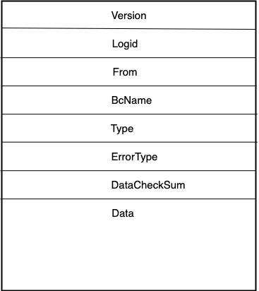
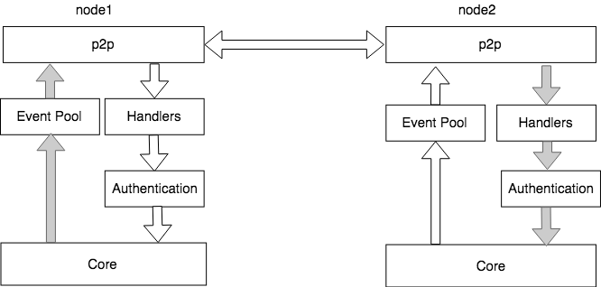
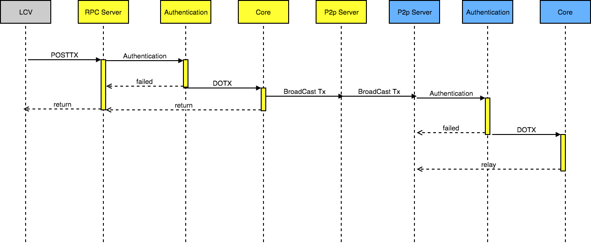

### 3.1 P2P网络概述

依据p2p网络中节点相互之间如何联系，可以将p2p网络简单区分为无结构和结构化两大类:

1. 非结构化p2p网络：这种p2p网络是最普通的，没有对结构做特别的设计。优点在于结构简单易于组建，网络局部区域内个体可以任意分布。对于节点的加入和离开网络也表现地非常稳定,比特币网络使用的就是无结构化的网络。但是这种网络主要有3个缺点，一是公网网络拥塞时传输效率低，二是存在泛洪循环，三是消息风暴问题。
2. 结构化p2p网络：这种p2p网络的结构经过精心设计，目的是为了增加路由效率，提高查询数据的效率，结构化p2p最普遍的实现方案是使用分布式哈希表（DHT），以太坊网络中使用的就是结构化的网络。

互联网的发展速度远远超过人们的预期，人们在制定网络协议之初没有考虑过网络规模会获得如此迅速的增长，导致ip地址的短缺。NAT技术通过将局域网内的主机地址映射为互联网上的有效ip地址，实现了网络地址的复用，从而部分解决了ip地址短缺的问题。网络中大部分用户处于各类NAT设备之后，导致在p2p网络中两个节点之间直接建立udp或者tcp链接难度比较大，应运而生的是NAT穿透技术。目前主要有两种途径，一种称为打洞，即UDP Punch技术；另一种是利用NAT设备的管理接口，称为UPnP技术。

### 3.2 xuperchain p2p网络

XuperChain 的p2p网络是可插拔的，目前支持libp2p模式和基于GRRC模式，libp2p使用KAD进行节点的路由管理，支持NAT穿透，主要用于公开网络的场景，节点规模可以达到万级；基于GRPC模式的p2p网络支持路由的自定义、节点的动态加入退出等功能，主要用于联盟链场景。

通过xchian.yaml中p2p module配置，选择p2p网络的模式。

XuperChain 定义了自己的协议类型 **XuperProtocolID = “/xuper/2.0.0”** ，所有的 XuperChain 网络节点除了基础的消息类型外还会监听并处理这个协议的网络消息。

#### 3.2.1 xuperchain p2p 消息

XuperChain 消息采用Protobuf定义，整个消息包括2部分，分别是消息头 `MessageHeader` 和消息体 `MessageData` ，具体如下所示：



其proto消息定义如下：

```
// XuperMessage is the message of Xuper p2p server
message XuperMessage {
    // MessageHeader is the message header of Xuper p2p server
    message MessageHeader {
        string version = 1;
        // dataCheckSum is the message data checksum, it can be used check where the message have been received
        string logid = 2;
        string from = 3;
        string bcname = 4;
        MessageType type = 5;
        uint32 dataCheckSum = 6;
        ErrorType errorType = 7;
    }
    // MessageData is the message data of Xuper p2p server
    message MessageData {
        // msgInfo is the message infomation, use protobuf coding style
        bytes msgInfo = 3;
    }
    MessageHeader Header = 1;
    MessageData Data = 2;
}
```

#### 3.2.2 模块交互图

XuperChain p2p网络模块与其他模块的交互如图所示，以libp2p模式为例：



上图左边是Xuper的启动流程，其中InitP2PServer的流程为启动P2P的核心流程，如右半部分所示，右半部分主要包括4个阶段，分别为：

1. InitP2pInstance：创建libp2p host实例
2. SetXuperStreamHandler：初始化p2p通信消息protocols，XuperProtocol为Xuper节点之间进行消息通信和消息处理的核心逻辑。
3. InitKadDht: 初始化libp2p KadDht，通过设置的bootstrap节点，建立自己的kad dht。
4. InitStreams: 前一步已经建立了自己的kad dht，下一步就是与这些邻近的节点之间建立通信流，通过libp2p的NewStream接口实现通信流建立。

至此，Xuper的p2p连接建立完毕。

####  3.2.3 交易消息处理流程 

用户提交的交易消息在 XuperChain 网络中传输的处理流程如下所示：



用户通过RPC将交易提交到网络中，交易执行成功后会通过p2p模块广播给网络中的其他节点。

