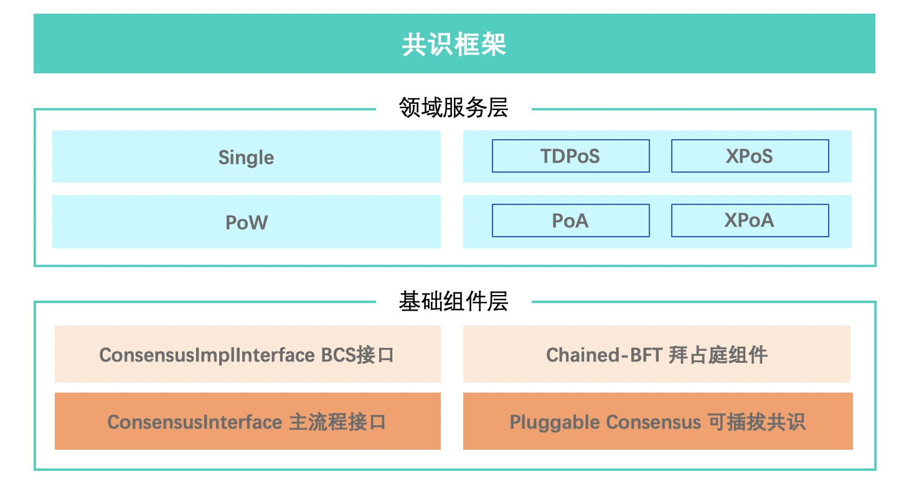
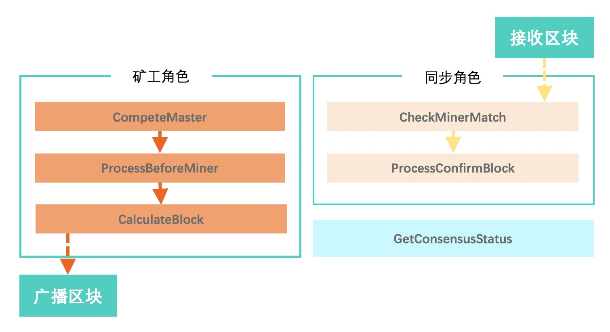
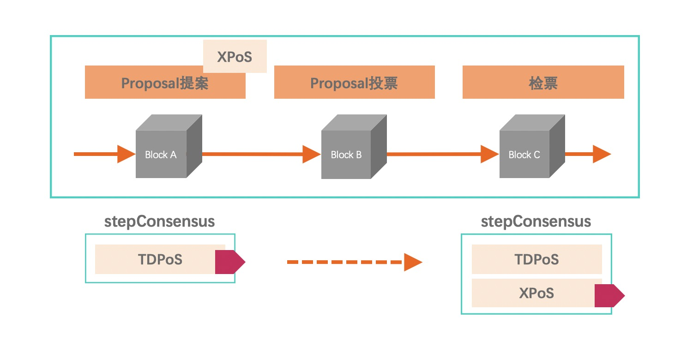

###  4.1 区块链共识机制概述

区块链系统多数采用去中心化的分布式设计，节点是分散在各处，系统需要设计一套完善的制度，以维护系统的执行顺序与公平性，统一区块链的版本，并奖励提供资源维护区块链的使用者，以及惩罚恶意的危害者。这样的制度，必须依赖某种方式来证明，是由谁取得了一个区块链的打包权(或称记帐权)，并且可以获取打包这一个区块的奖励;又或者是谁意图进行危害，就会获得一定的惩罚，这些都是区块链系统的共识机制需要解决的问题。

随着区块链应用落地场景越来越多，很多适应不同应用场景的共识算法先后被提出。但是在当前的技术背景下，功能过于全面的共识算法无法真正可用。在新一代区块链共识机制的设计过程中，根据实际应用场景，有的放矢的选择去中心化、节能、安全等设计原则，对一些原则支持强弱进行取舍，将一定程度上提升系统的整体运行效率。

我们 XuperChain 设计上是一个通用的区块链框架，用户可以方便地进行二次开发定制。 XuperChain 的共识模块设计上是一个能够复用底层共识安全的共识框架，用户基于这样的框架可以轻松地定义其自己的链，而不需要考虑底层的共识安全和网络安全。

### 4.2 xuperchain共识框架

共识模块依照XuperCore整体框架要求来进行设计与实现，整体分成两层设计，上层为领域服务层BCS（Blockchain Core Service），主要包含的是提供给用户的四大类共识组件，下层为基础组件层Kernel层，主要包含引擎使用的共识接口，支持共识热插拔切换的可插拔共识组件，BCS层需实现的共识实现接口，以及提供拜占庭容错能力的Chained-BFT组件。整体结构如下图所示。

### 4.3 XuperChain 共识矩阵

| 共识算法名称 | 确认效率    | 备注                                                       |
| ------------ | ----------- | ---------------------------------------------------------- |
| Single       | 立即        |                                                            |
| PoW          | 经验值      | 比特币经验值为7个块                                        |
| TDPoS        | 基于最长链  | 矿工轮值期间可产生回滚                                     |
| XPoS         | 3个区块以后 | XPoS为TDPoS加上Chained-BFT组件，三个区块后落盘后不可回滚。 |
| PoA          | 基于最长链  | 矿工轮值期间可产生回滚                                     |
| XPoA         | 3个区块以后 | XPoA为PoA加上Chained-BFT组件，三个区块后落盘后不可回滚。   |

### 4.4 Kernel组件: 共识主流程

Kernel层的ConsensusInterface定义了嵌套在引擎流程的共识组件参与逻辑，其对外暴露为一套接口，具体流程接口如下。

在区块同步和生产中涉及到两个角色，矿工和同步者，在进程生命周期内，同一时刻角色只能是二选其一，节点通过共识提供的CompeteMaster来确定自身是否是矿工，若是则走矿工流程，将交易打包到区块并广播；若不是则走同步者流程，从网络中获取区块，检查区块有效性并决定是否更新到到账本。具体流程细节大致如下:

- 用户提交交易到网络，交易执行完后会进入未确认状态，并记录在交易的未确认列表中。
- 节点通过访问Consensus模块CompeteMaster接口判断自己是否为当前的矿工。
- 节点若为矿工，首先通过Consensus模块ProcessBeforeMiner接口更新自己共识内存状态，准备开始生产区块。
- 节点若为矿工，将未确认消息打包到一个简单区块。
- 节点若为矿工，通过Consensus模块CalculateBlock接口对打包好的简单区块进行共识相关运算（目前仅当在PoW共识中需进行工作量证明）。
- 若节点为矿工，最终将打包好的区块广播到P2P网络。
- 若节点为同步者，通过Consensus模块提供的CheckMinerMatch接口对区块进行合法性校验。
- 若节点为同步者，通过ProcessConfirmBlock进行共识内存更新。

所有共识均实现GetConsensusStatus，向客户端提供读接口以便展示当前共识状态信息。

### 4.5 Kernel组件: Pluggable Consensus可插拔共识

可插拔共识组件提供了可热插拔的共识算法替换更新能力。用户可根据“提案-投票”治理流程进行共识升级，共识升级后，全网共识算法将获得更新。Pluggable Consensus组件也实现了ConsensusInterface接口，主流程主要通过调用Pluggable Consensus的接口来进行共识读写。具体如下图所示。

### 4.6 Kernel组件: Chained-BFT

Chained-BFT组件使用了Libra项目的Chained-Hotstuff分布式一致性算法。 XuperCore基于论文 [HotStuff: BFT Consensus with Linearity and Responsiveness](https://dl.acm.org/doi/10.1145/3293611.3331591) 以及论文 [State Machine Replication in the Libra Blockchain](https://cryptorating.eu/whitepapers/Libra/libra-consensus-state-machine-replication-in-the-libra-blockchain.pdf) 实现。 在Chained-Hotstuff之上，我们针对自身系统特性对算法做了一些改造。
