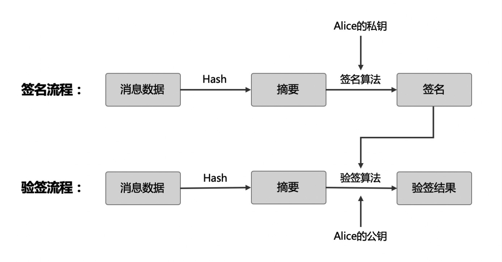

###  2.1 背景

密码学技术是区块链的核心基础技术之一，承担着区块链不可篡改和去中心化验证等特性的底层支撑。在 XuperChain 中，密码学技术广泛应用在账户体系、交易签名、数据隐私保护等方面，主要以ECC(椭圆曲线密码体系)以及多种Hash散列算法为基础，发展出的一个单独的模块。

### 2.2 密码学基础

####  2.2.1 哈希函数

`加密哈希函数(Hash Function)` 是适用于密码学的哈希散列函数，是现代密码学的基本工具。它是一种数学算法，将任意大小的数据（通常称为“消息”）映射到固定大小的二进制串（称之为“散列值”，“散列”或“消息摘要”），并且是单向的功能，即一种实际上不可逆转的功能。理想情况下，查找生成给定哈希的消息的唯一方法是尝试对可能的输入进行暴力搜索，以查看它们是否产生匹配，或使用匹配哈希的彩虹表。

`MD5` 摘要长度为128bit，由于容易受到碰撞攻击，目前使用越来越少。

`SHA256` SHA系列哈希算法由美国国家安全局制定，具有多个hash算法标准，可以产生160~512bit不等的哈希摘要。目前在区块链中使用较多的是SHA256，摘要长度为256bit，具有较高的抗碰撞攻击安全性。

`RIPEMD-160` 产生长度为160bit的摘要串。 相比于美国国家安全局设计的SHA-1和SHA-2算法，RIPEMD-160的设计原理是开放的。

####  2.2.2 ECC

构建区块链的去中心化交易，需要一种加密算法，使交易发起人使用持有的密钥对交易数据进行数字签名，而交易验证者只需要知道交易发起人的公开信息，即可对交易有效性进行验证，确定该交易确实来自交易发起者。这种场景在密码学中称之为`公开密钥加密`，也称之为非对称密钥加密。

常见的公开密钥算法如RSA、ECC(Elliptic Curve Cryptography，缩写为 ECC)等，RSA起步较早，此前在非对称加密领域使用范围最广，例如目前的SSL证书大多采用RSA算法。而在ECC算法问世后，由于在抗攻击性、资源消耗等方面相比RSA具有更好的表现，其使用也越来越广泛。

公钥密码算法一般都基于一个数学难题，比如RSA的依据是给定两个数p, q很容易相乘得到N， 当N足够大时，对N进行因式分解则相对困难的多。**ECC是建立在基于椭圆曲线的离散对数问题上的密码体制，给定椭圆曲线上的一个点P，一个整数k，求解Q=kP很容易；给定一个点P、Q，知道Q=kP，求整数k却是一个难题。** 

椭圆曲线密码学包含了多种密码学算法，下面列出在 XuperChain 中涉及到的一些算法：

- `ECIES` (Elliptic Curve Integrated Encryption Scheme): 椭圆曲线集成加密算法，主要用于基于椭圆曲线的数据加解密。
- `ECDH` (Elliptic Curve Diffie–Hellman): 基于Diffie–Hellman算法的一种密钥协商算法，定义了双方如何安全的生成和交换密钥。
- `ECDSA` (Elliptic Curve Digital Signature Algorithm): 是使用椭圆曲线密码学实现的DSA(数字签名算法)，一般发起人对消息摘要使用私钥签名，验证者可以通过公钥对签名有效性进行验证。

椭圆曲线算法由于采用的椭圆曲线的不同，具有多种不同的算法标准，典型的如：

- NIST标准，典型的曲线如P-256/P-384/P-521等；

- SECG标准，典型的如Secp256k1/Secp256r1/ secp192k1/ secp192r1等；

- ECC25519，主要指Ed25519数字签名和Curve25519密钥协商标准等；

- 国产密码算法，中国国家密码局制定的密码学算法标准，典型的如SM2/3/4等。

####  2.2.3 多重签名和环签名

多重签名是指在数字签名中，有时需要多个用户对同一个交易进行签名和认证，例如某些合约账户下的数据需要多个人授权才能修改或转账。

在密码学中，通过多重签名可以将多个用户的授权签名信息压缩在同一个签名中，这样相比于每个用户产生一个签名的数据体量会小很多，因此其验签计算、网络传输的资源开销也会少很多。

环签名是一种数字签名技术，环签名的一个安全属性是无法通过计算还原出一组用户中具体使用私钥签名的用户。也就是说，使用环签名技术可以使一组用户中的某一个人对消息进行签名，而并不会泄露签名者是这组用户中的哪个人。环签名与组签名类似，但在两个关键方面有所不同：第一，单个签名具有匿名性; 第二，任何一批用户都可以作为一个组使用，无需额外设置。

在实际使用中，多重签名主要用作多人实名授权的交易，通过产生更小的签名数据提升网络传输和计算效率，而环签名则主要用于对交易隐私保护和匿名性有要求的交易场景中。

### 2.3 xuperchain 中密码学使用

####  2.3.1 用户公私钥账户

XuperChain 的用户账户体系基于非对称公私钥对，每个用户账户对应这一组公私钥对，并采用一定的哈希算法将公钥摘要成一个字符串作为用户账户地址(address)。

考虑到密钥不具备可读性，为了帮助用户保存密钥， XuperChain 实现了BIP39提案的助记词技术。

- 助记词的生成过程：首先生成一个长度在128~256bit之间的随机熵，由此在助记词表中选出对应的单词列表，形成助记词。
- 助记词产生私钥：使用基于口令的密钥派生算法PBKDF2，将上述生成的助记词和用户指定的密钥作为密钥派生算法参数，生成长度为512bit的种子，以此种子作为生成密钥的随机参数，便产生了了从助记词生成的私钥。
- 通过助记词恢复密钥：由于用户持有生成密钥的助记词和口令，因此在用户私钥遗忘或丢失时，可以通过同样的助记词和口令，执行助记词产生私钥的过程，从而恢复出账户密钥。

#### 2.3.2 数据签名

XuperChain 中，每个交易都需要交易发起人以及交易背书人的签名；在每个块生成时，也需要加上打包块的节点的签名。

- **交易签名：** 基于交易数据摘要，会包含交易输入输出、合约调用、合约读写集、发起人和背书人信息等，并将交易数据序列化后的字节数组使用双重SHA256得到摘要数据，最后对摘要数据用ECDSA或其他数字签名算法产生交易签名。

- **块签名：** 基于区块数据摘要，会包含区块元信息如前序块Hash值、交易Merkle树根、打包时间、出块节点等数据，并在序列化后使用双重SHA256得到摘要数据，最后对摘要数据用ECDSA或其他数字签名算法产生区块签名。

  

#### 2.3.3 通信加密

XuperChain 底层采用P2P网络传播交易和区块数据，在一些许可区块链网络场景中，需要对节点间的数据传输进行加密提升安全和隐私性，因此 XuperChain 的P2P连接支持基于ECDH的密钥交换算法的TLS连接。

ECDH的原理是交换双方可以在不共享任何秘密的情况下协商出一个密钥，双方只要知道对方的公钥，就能和自己的私钥通过计算得出同一份数据，而这份数据就可以作为双方接下来对称加密的密钥。

- 第一阶段是Propose阶段，这一阶段，对等节点间互相交换双方永久公钥PK。
- 第二阶段是Exchange阶段，本质是基于ECDH的密钥交换。双方通过ECC算法随机生成一组临时密钥对(tempPK, tempSK)，然后用自己的永久私钥对临时公钥tempPK进行签名并交换。这时，双方可以通过第一步的公钥进行验签，同时拿到供本次会话使用的临时公钥。使用临时公钥的好处是一话一密，即使本次会话密钥泄露也不会导致以前的加密数据被破解。ECDH算法使得双方通过对方的公钥和自己的私钥，可以获得一致的共享密钥SharedKey。
- 第三阶段是Verify阶段。双方使用ShareKey产生两组密钥Key1，Key2分别作为读写密钥，并使用支持的对称加密算法(AES/blowfish)加密传输第一步中发送给对方的Nonce，而接收方则使用刚才协商的密钥对数据解密，并验证Nonce是不是等于第一步中自己发送给对方的值。

通过这三次握手，双方建立了加密通信通道，并且节点间通信加密信道满足一话一密的高安全等级。

### 2.4 密码学模块

####  2.4.1 Crypto Provider Interface

XuperChain 抽象出了统一的密码学相关的功能，并在此之上定义了统一的密码学接口，我们称之为Crypto Provider Interface，并通过CryptoClient接口向上层区块链系统系统密码学功能。CryptoClient目前由一组接口构成：

```
// CryptoClient is the interface of all Crypto functions
type CryptoClient interface {
    CryptoCore
    KeyUtils
    AccountUtils
    MultiSig
}
```

整个CryptoClient由四部分功能接口组成：

- `CryptoCore` ： 主要提供包括加解密、签名等密码学核心功能；
- `KeyUtils` : 主要提供公私钥相关工具，例如密钥对象和JSON、文件格式之间的转换等；
- `AccountUtils` : 主要提供账户相关的功能接口，例如创建账户、助记词导出私钥等；
- `MultiSig` : 主要提供多重签名、环签名相关功能接口。

####  2.4.2  密码学使用

目前 XuperChain 已经支持了包括 Nist P256 + ECDSA/Schnorr 以及 国密 等多种密码学套件，并且已经开源了 **Nist P256 + ECDSA/Schnorr** 和 **国密** 算法实现。

为了方便框架使用密码学套件， XuperChain 在 crypto/client 包中封装了一层密码学管理器，支持创建指定类型的密码学对象，或者通过公私钥自动识别需要加载的组件类型。通过密码学管理器，可以支持隔绝框架对密码学类型感知，对上层框架提供一种无缝的使用体验。

XuperChain 中默认密码学组件使用的是Nist P256 + ECDSA，在不额外指定的情况下， XuperChain 启动后会加载默认密码学组件。

之前说过，通过密码学组件管理器可以按照公私钥自动识别需要加载的组件类型，那么 XuperChain 如何根据密钥来判断应该使用哪种密码学组件呢？其实，不同的密码学组件是通过密钥中的曲线类型来确定的，目前系统中定义了三种不同的曲线类型：

- `P-256` : 使用Nist P256+ECDSA的默认组件；
- `P-256-SN` : 使用Nist P256 + Schnorr签名的组件，可以提供更高的签名验签性能;
- `SM2-P-256` : 使用SM2/3/4的国密组件，符合中国国家密码局制定的密码学标准。

实际使用中，可以通过创建链时的配置中的密码学类型指定使用哪种密码学组件，以schnorr签名为例，在创世块配置中添加下述配置即可：

```
"crypto": "schnorr"
```

####  2.4.3 国密组件使用方法

目前我们开源的国密密码学组件支持SM2/SM3/SM4算法，并且国密组件支持对Nist P256算法生成的地址和签名数据进行验签。

如果要创建一个基于国密算法的链，需要完成以下几个步骤：

1. 首先对每个节点创建一个基于国密算法生成的节点私钥和地址。 注意，`data/keys` 目录原来保存的是默认密码学组件生成的私钥，可以删除原私钥目录，或者使用 `-f` 参数强制覆盖原私钥。如果不希望覆盖原节点密钥，可以在 `--output` 参数后面指定新的私钥目录。私钥生成后，可以查看私钥文件，其中 `Curvname` 应该是 `SM2-P-256` 。
```
# 删除原来的地址
$ rm -r  data/keys
# 新生成国密
$ bin/xchain-cli account newkeys --output data/keys --crypto gm
$ cat cat data/keys/public.key
# 可以看到公钥中的 Curvname 为 SM2-P-256
```
2. 修改待创建链的创世块配置，通过 crypto 字段指定默认密码学组件为国密组件，并修改矿工地址为新生成的国密私钥对应的地址。一般默认创世块配置位于 data/genesis/xuper.json ，修改创世块配置：

   ```
   {
       ...,
       "predistribution": [{
           "address": "此处替换为国密address",
           "quota": "100000000000000000000"
        }],
       "crypto": "gm",
       ...,
       "genesis_consensus": {
       "name": "tdpos",
       "config": {
           ...,
           "init_proposer": {
               "1": [
                   "此处替换为国密address"
               ]}
           }
       }
   }
   ```

3. 使用命令行进行操作时，需要通过 --crypto 参数指定加密类型为国密，例如transfer命令。

```
# 启动链
$ bash control.sh start

$ ./bin/xchain-cli transfer --to alice --amount 1 --keys data/keys --crypto gm
```

