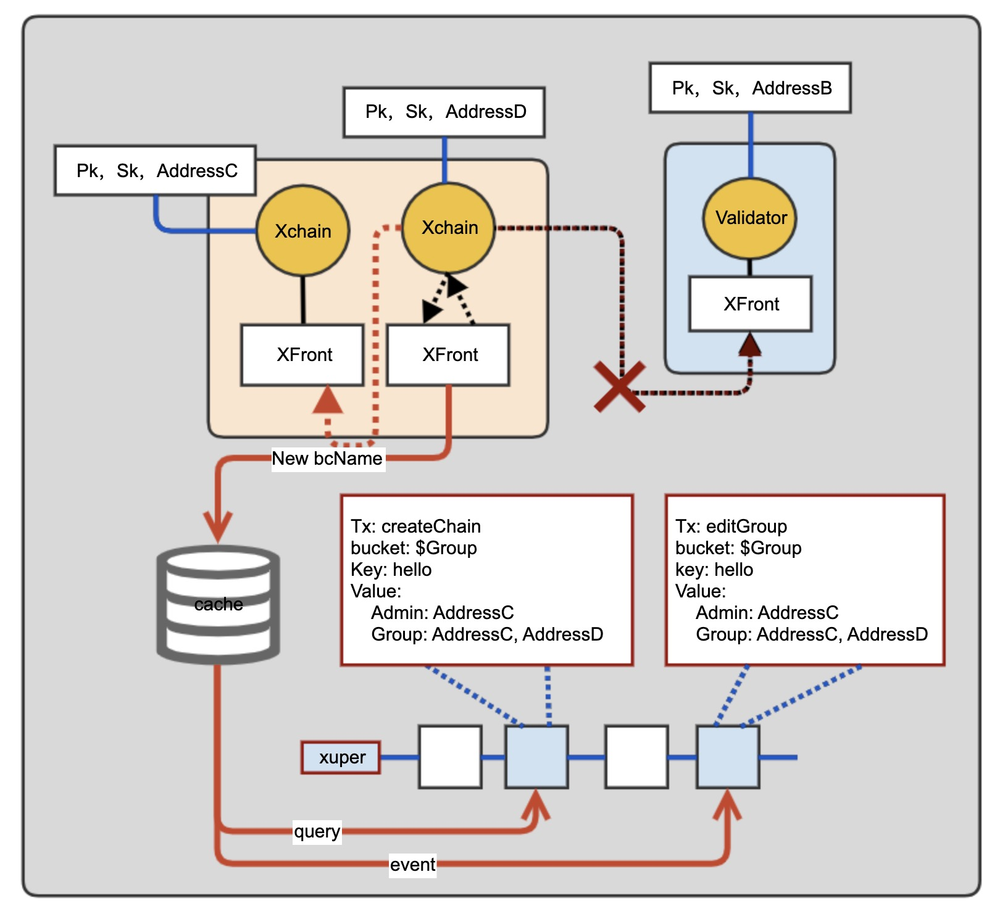

平行链群组用来对XuperChain的特定区块链进行管理，该功能需配合Xuper-Front联合使用以最终保证安全性.

#### 7.1  平行链群组流程

平行链、群组和CA中心的运行流程如下图所示。

平行链群组的设计参考了Fabric对组织的设计，Group代表一群身份实体的集合，Group中可以添加地址信息，则这些信息可以相互共享平行链。 - 创建平行链时，需要绑定一个组织列表Group，ParaChain只允许组织列表Group中的身份访问其读写接口。

- Group有admin权限，其为一个list结构，admin可以有权限向Group添加和删除成员。

- Group有identities权限，其为一个list结构，identities可以有权限查询Group中的合约信息。

- 更改Group信息通过系统合约实现，editGroupchain方法。

#### 7.2 技术细节

