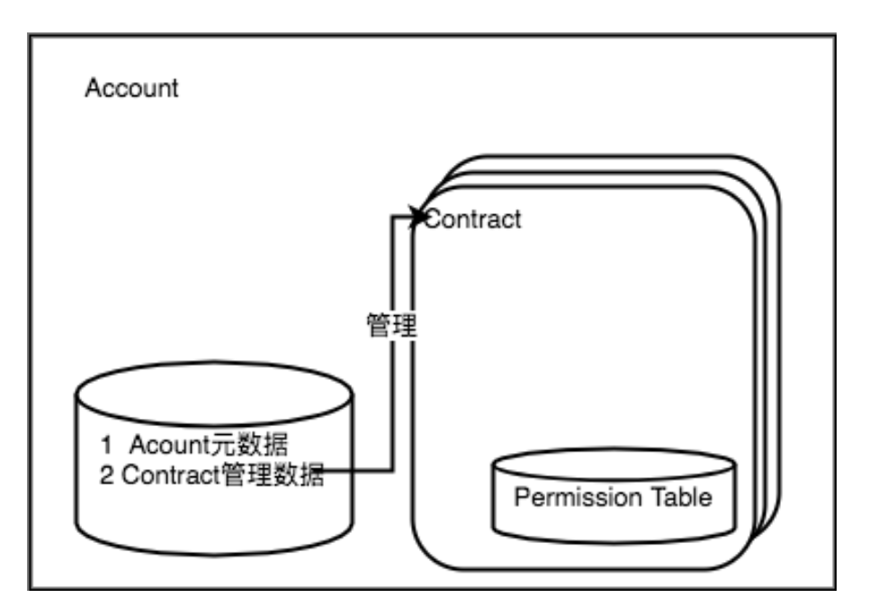
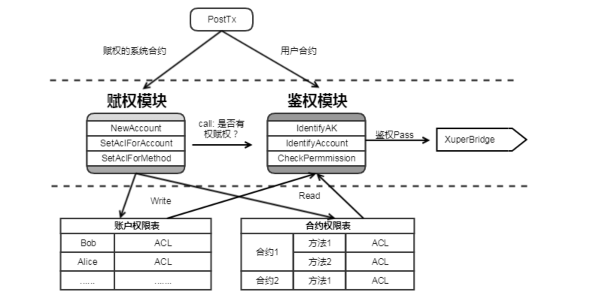

#### 6.1 名词解析

- `AK(Access Key)` ：具体的一个address，由密码学算法生成一组公私钥对，然后将公钥用指定编码方式压缩为一个地址。
- `账号（Account)` : 在 XuperChain 上部署合约需要有账号， 账号可以绑定一组AK（公钥），并且AK可以有不同的权重。 账号的名字具有唯一性。
- `合约 (Contract)` : 一段部署在区块链上的可执行字节码，合约的运行会更新区块链的状态。我们允许一个账号部署多个合约。合约的名字具有唯一性。

#### 6.2 模型简介
系统会首先识别用户，然后根据被操作对象的ACL的信息来决定用户能否对其进行哪些操作


- 个人账号AK：是指一个具体的地址Addr
  - 用户的创建是离线的行为，可以通过命令行工具或者API进行创建
  
- 合约账号： XuperChain 智能合约的管理单元。
  - 账号的创建：
    - 任何账号或者AK都可以调用系统级智能合约创建账号
    - 创建账号需要指定账号对应的拥有者的地址集，如果一个账号中只有一个地址, 那么这个Addr对账号完全控制；
    - 创建账号需要指定ACL控制策略，用于账号其他管理动作的权限控制；
    - 创建账号需要消耗账号资源；- 
  
- 账号名命名规则；合约账号由三部分组成，分为前缀，中间部分，后缀。前缀为XC，后缀为@链名中间部分为16个数字组成。在创建合约账号的时候，只需要传入16位数字，在使用合约账号的时候，使用完整的账号。

- 账号管理：依地址集合据创建时指定的地址集和权限策略，管理账号其他操作账号股东剔除和加入账号资产转账创建合约，创建智能合约需要消耗账号资源，先将utxo资源打到账号下，通过消耗账号的utxo资源创建合约，验证的逻辑需要走账号的ACL控制合约Method权限模型管理

- 智能合约： XuperChain 中的一个具体的合约，属于某个账号账号所属人员允许在账号内部署合约账号所属人员可以定义合约管理的权限模型设置合约方法的权限模型，合约内有一个权限表，记录：{ contract.method，permission_model}

- 合约命名规则：长度为4~16个字符(包括4和16)，首字母可选项为[a-ZA-Z_]，末尾字符可选项为[a-zA-Z0-9_]，中间部分的字符可选项为[a-zA-Z_.]

#### 6.3 实现功能

ACL主要有两个功能：账号权限管理、合约权限管理

1. 账号权限管理 账号的创建、添加和删除AK、设置AK权重、权限模型

2. 合约权限管理 设置合约调用权限，支持2种权限模型：

   背书阈值：在名单中的AK或Account签名且他们的权重值加起来超过一定阈值，就可以调用合约AK集合: 定义多组AK集合，集合内的AK需要全部签名，集合间只要有一个集合有全部签名即可

####  6.4 系统设计



#### 6.5 ACL数据结构说明

```
// --------   Account and Permission Section -------
enum PermissionRule {
    NULL = 0;             // 无权限控制
    SIGN_THRESHOLD = 1;   // 签名阈值策略
    SIGN_AKSET = 2;       // AKSet签名策略
    SIGN_RATE = 3;        // 签名率策略
    SIGN_SUM = 4;         // 签名个数策略
    CA_SERVER = 5;        // CA服务器鉴权
    COMMUNITY_VOTE = 6;   // 社区治理
}

message PermissionModel {
    PermissionRule rule = 1;
    double acceptValue = 2;    // 取决于用哪种rule, 可以表示签名率，签名数或权重阈值
}

// AK集的表示方法
message AkSet {
    repeated string aks = 1; //一堆公钥
}

message AkSets {
    map<string, AkSet> sets = 1;   // 公钥or账号名集
    string expression = 2;      // 表达式，一期不支持表达式，默认集合内是and，集合间是or
}

// Acl实际使用的结构
message Acl {
    PermissionModel  pm = 1;             // 采用的权限模型
    map<string, double>  aksWeight = 2;  // 公钥or账号名  -> 权重
    AkSets akSets = 3;
}
```

签名阈值策略： `Sum{Weight(AK_i) , if sign_ok(AK_i)} >= acceptValue`

####  6.6 系统合约接口

| 合约接口            | 用途                |
| ------------------- | ------------------- |
| NewAccountMethod    | 创建新的账号        |
| SetAccountACLMethod | 更新账号的ACL       |
| SetMethodACLMethod  | 更新合约Method的ACL |

####  6.7 样例

```
{
    "pm": {
        "rule": 1,

        "acceptValue": 1.0
    },
    "aksWeight": {
        "AK1": 1.0,
        "AK2": 1.0
    }
}
```

- 其中rule=1表示签名阈值策略，rule=2表示AKSet签名策略
- 签名的ak对应的weight值加起来>acceptValue，则符合要求

