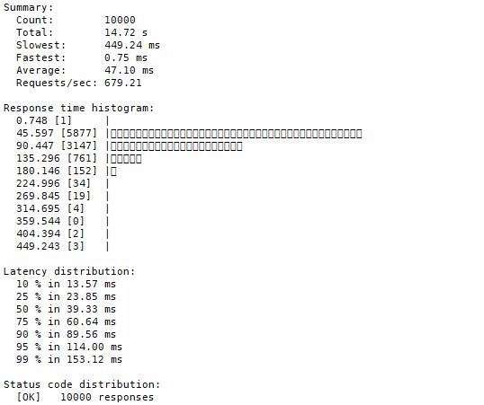
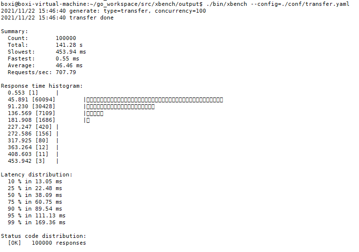
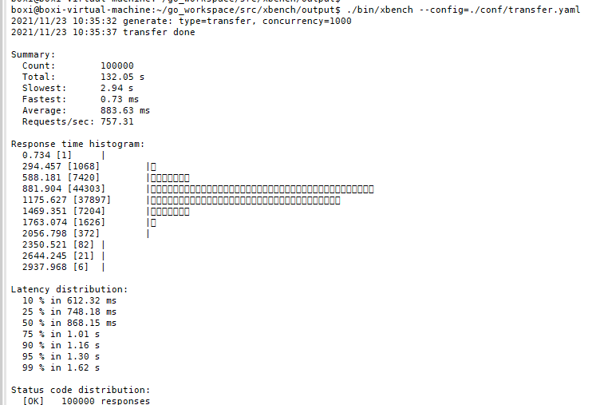
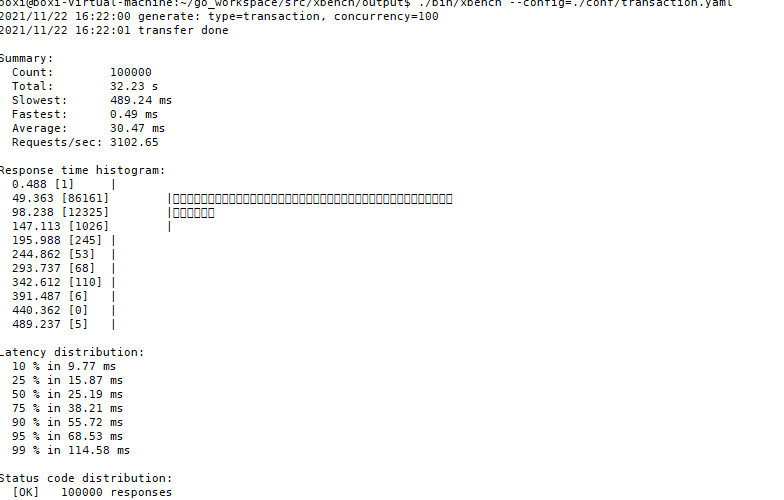
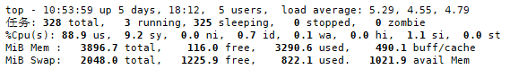
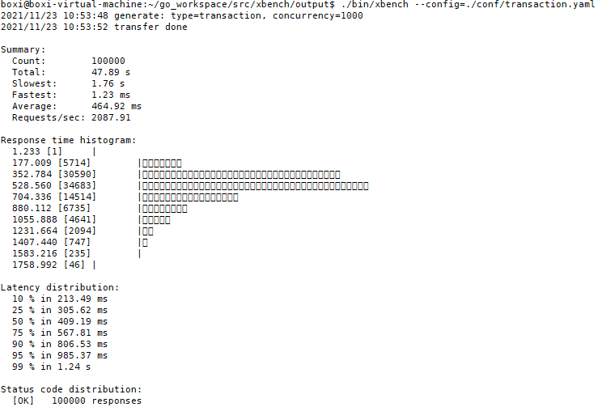
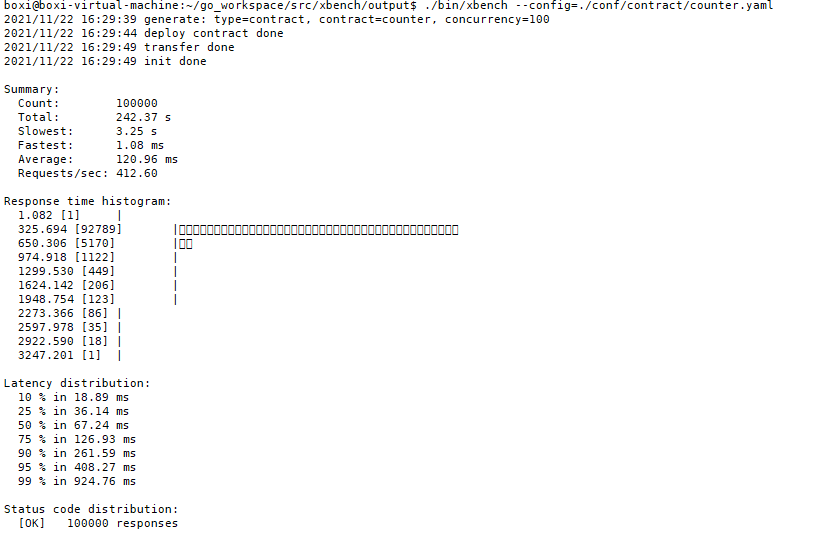
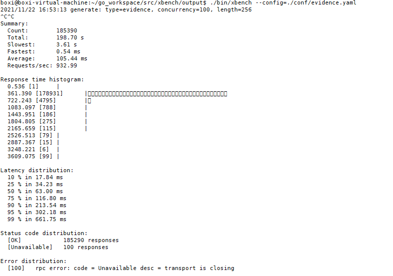

[xbench](https://github.com/xuperchain/xbench) 是矩链的压测工具，支持和 Prometheus + Grafana 监控节点。 同时支持转账、存证、合约等相关压测场景，可以通过 grafana 实时看到节点状态。

### 1 环境搭建

#### 1.1 监控环境搭建

 Prometheus + Grafana 监控系统的流程参考监控环境搭建章节。结合可视化工具可以清楚的看到压测的过程，方便查看。

#### 1.2 网络测试环境搭建

以三节点网络进行测试，其中可以再启动链的时候选择共识。下面介绍压测环境搭建：

1. 下载xchain，并编译。

```
git clone https://github.com/superconsensus-chain/xuperchain.git
cd xuperchain
make
make testnet
```

2.修改配置

a. env.yaml

```
# Metric switch
metricSwitch: true
```
b. server.yaml （注意修改其他节点端口不同）
```
metricPort: 37201
```
c. xuper.json
```
# 去掉交易费用方便压测
nofee:true
```
4.启动网络

```
cd testnet/node1
bash control.sh start
cd ../node2
bash control.sh start
cd ../node3
bash control.sh start
```

### 2 xbench使用

#### 2.1 准备压测环境

1.下载xbench,并编译

```
git clone https://github.com/xuperchain/xbench.git
cd xbench
make
```
2. 准备测试资源。

xbench 在编译成功后，output 目录下会有 data/bank 目录，此目录下的 address 文件中的地址为 xbench 测试时需要的初始地址。


在 xuperchain 的 testnet/node1 目录下执行以下命令转账给 xbench 账户：

```
./bin/xchain-cli transfer --to dw3RjnTe47G4u6a6hHWCfEhtaDkgdYWTE --amount 1000000000000
#其中 dw3RjnTe47G4u6a6hHWCfEhtaDkgdYWTE 地址为 xbench 下 data/bank/address 地址。
```

#### 2.2 transfer转账压测

 转账压测，通过调用sdk生成交易数据

##### 2.2.1 修改xbench 配置文件

```
# (conf/transfer.yaml)
# 压测配置
total: 500000               # 请求总量
concurrency: 100            # 并发量

# 压测case参数
tags:
  benchmark: "transfer"     # 压测类型
  amount: "100000000"       # 压测账户初始token数

# 压测节点
host: "127.0.0.1:37101"                 
```

##### 2.2.2 xbench 启动命令

```
./bin/xbench --config=./conf/transfer.yaml
```

##### 2.2.3 压测效果

结论：50万级有压力

a. 虚拟机配置

​	虚拟机Ubuntu20.04  4G  4核

b. 万级(20秒内)



c. 十万级（150秒内）



​	d. 请求量十万，并发数量1000，表现数据较好

 

#### 2.3 transaction压测

​	转账压测，离线生成交易数据，没有进行 SelectUTXO

##### 2.3.1 修改配置

```
# 文件路径conf/evidence
# 压测配置
total: 100000               # 请求总量
concurrency: 100            # 并发量

# 压测case参数
tags:
  benchmark: "transaction"  # 压测类型
  amount: "100000000"       # 压测账户初始token数

# 压测节点
host: "127.0.0.1:37101"
```

#####  2.3.2 十万请求的压测数据

a. 请求总量十万，并发100



b. 请求十万，并发1000数据





#### 2.4 counter合约压测

​	counter合约压测，调用sdk生成数据

##### 2.4.1 修改配置

```
#conf/counter.yaml
# 压测配置
total: 100000               # 请求总量
concurrency: 100            # 并发量

# 压测case参数
tags:
  benchmark: "contract"     # 压测类型
  amount: "100000000"       # 压测账户初始token数

  contract_account: "XC1234567890123456@xuper"  # 合约账户
  code_path: "./data/contract/counter.wasm"     # 合约二进制文件的路径

  module_name: "wasm"       # 合约类型
  contract_name: "counter"  # 合约名
  method_name: "increase"   # 合约方法

# 压测节点
host: "127.0.0.1:37101"
```

##### 2.4.2 十万请求压测结果

a. 并发100



b. 并发1000


#### 2.5  evidence:存证压测

 evidence: 存证压测，离线生成存证数据，存证数据存放在desc字段

##### 2.5.1 修改配置

```
# conf/evidence.yaml
# 压测配置
total: 10000             # 请求总量
concurrency: 100          # 并发量

# 压测case参数
tags:
  benchmark: "evidence"   # 压测类型
  length: "256"           # 压测账户初始token数

# 压测节点
host: "127.0.0.1:37101"
```

##### 2.5.2 十万请求压测效果



